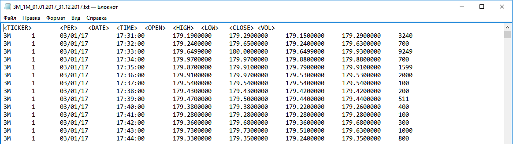
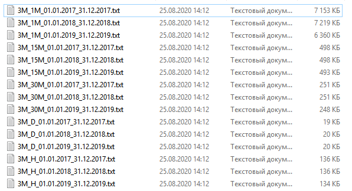

# Qt-charts

Simple charts based on QGraphicsView and QGraphicsItems.
No need to use QCharts library.

Charts available only for period 2017-2019 year and time interval like 1 minute, 15 minutes, 30 minutes, 1 hour, 1 day, 1 week and 1 month.
If you want to make your own paper then scroll down.

Data for graphics loaded from web page:
 https://www.finam.ru/profile/akcii-usa-bats/american-express/export/

 https://www.finam.ru/profile/akcii-usa-bats/3m-co/export/

There are 3 views of interval graphics:
#Candlebar:

#Rangebar and Line chart:

#Also available volume charts:

#Cross cursor and Fibbonacci lines:

#And average true range line:

If you wish to load another paper, then follow this view while loading from www.finam.ru

And split data by year and time period (minute, 15min, 30min, hour, day, week, month) as shown in the picture below:

